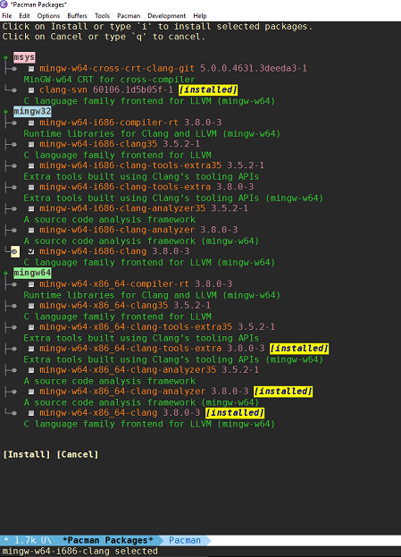

*Author:* Noah Peart <noah.v.peart@gmail.com> 
*URL:* [https://github.com/nverno/emacs-msys](https://github.com/nverno/emacs-msys) 

Some utilities to open msys2 shells and install packages/interact with
pacman from Emacs.

The main entry point is `msys-pacman`, which calls pacman to search or install
packages.  When searching, the results are displayed in `pacman-mode`.  
 
Pacman mode:

 Provides emacs major mode to select and install packages from pacman
 package manager using a `tree-widget` format to have nodes for
 packages available under msys, mingw32, or mingw64 nodes.

 Some features:
 - Toggle msys/mingw32/mingw64 package results
 - Mark and install packages
 - Font-locking for msys/mingw32/mingw64 and installed packages

---
Converted from `msys.el` by [*el2markdown*](https://github.com/Lindydancer/el2markdown).
